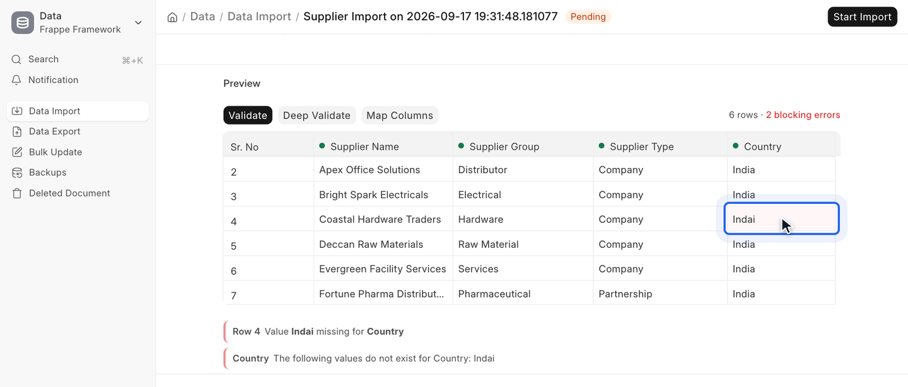
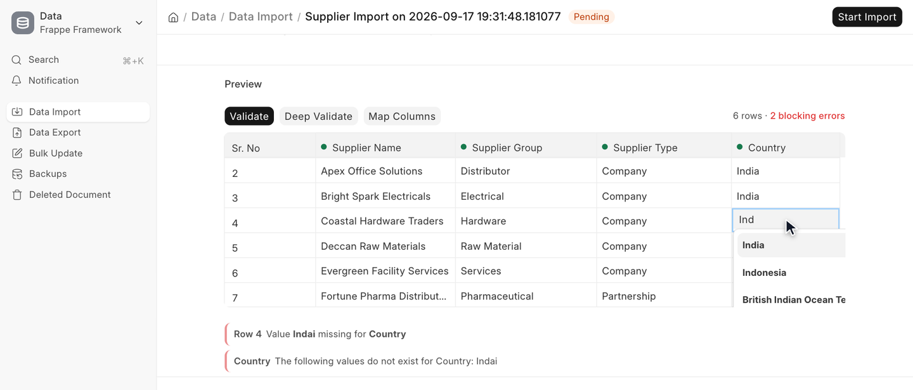
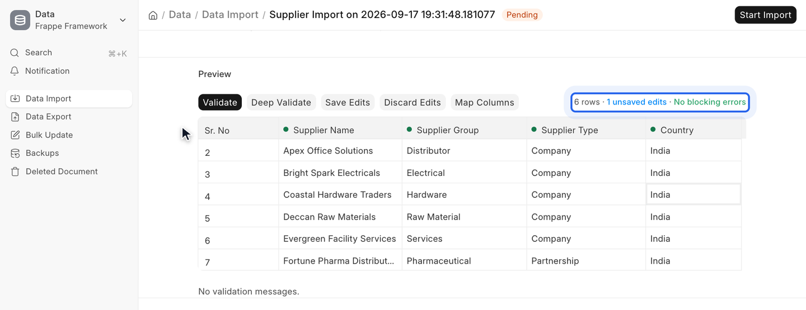
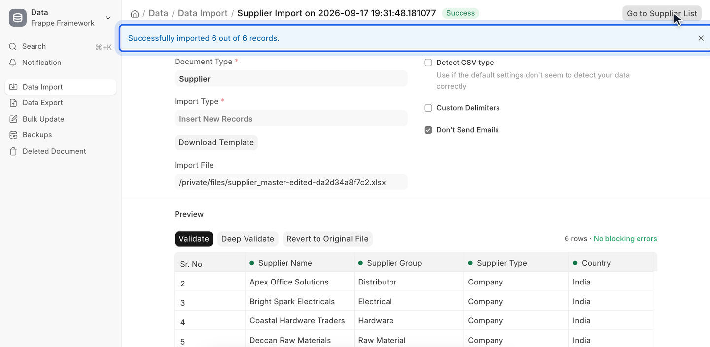

# Editable Data Import

**An enhancement to the existing Frappe/ERPNext Data Import that allows users to edit uploaded data directly in the preview instead of correcting the Excel/CSV file and re-uploading it.**



## The problem

The standard Data Import shows a read-only preview of the first 10 rows. When
the uploaded file contains a mistake - a typo in a linked record, a value that is
not a valid option, a date in the wrong format - the only way to fix it is to go
back to the spreadsheet, correct it, save it, upload it again and check the
preview again. On a file with several problems, that loop repeats.

Some problems are also not visible in the preview at all. The standard preview
reports link and option problems per column rather than per row, and missing
mandatory values or other document validation errors only appear once the import
has actually been attempted.

## How it enhances the standard Data Import

Editable Data Import is not a separate import tool. It works inside the existing
**Data Import** form and hands over to the existing importer:

- The read-only preview is replaced by an editable grid, built from the same
  `frappe-datatable` component the standard preview uses. Cells are edited with
  Frappe's own form controls, the same ones the Report View uses for inline
  editing.
- Validation reuses Frappe's own import checks and shows each problem on the cell
  it belongs to.
- When the edits are saved, or when the import is started, the edited data is
  written to a new CSV/XLSX file and the Data Import is pointed at that file. The
  standard importer then runs unchanged and imports exactly what the grid shows.
- The file that was originally uploaded is kept, and can be restored.

No Frappe or ERPNext source file is modified. The app is delivered through the
`doctype_js` hook and its own whitelisted API methods, and the standard Data
Import endpoints keep working as before.

## Features

- **Edit any imported cell in the preview.** Link fields offer the normal
  autocomplete, Date fields a date picker, Select fields their options, and Check
  and number fields their usual editors.
- **All rows, not just the first 10.** Large files are shown in pages of 2,000
  rows by default, and the grid only renders the rows on screen. Edits are kept
  while moving between pages.
- **Cell-level validation.** Blocking problems are shown in red and warnings in
  amber, with a message list under the grid. Clicking a message moves to the cell.
- **Revalidate at any time** without saving anything.
- **Deep Validate** (optional) runs the real document validation - mandatory
  fields and the DocType's own validation rules - for every row inside a database
  savepoint, then rolls it back, so nothing is created.
- **Numbers that would silently become 0** (for example `abc` or `N/A` in a
  Currency column) are flagged as warnings.
- **Import is blocked while blocking errors remain.** The check follows the same
  rule the standard importer applies.
- **Child tables.** For documents spread over several rows, the parent columns of
  the follow-on rows stay locked, so an edit cannot accidentally split one
  document into two. The child columns remain editable.
- **Keep, discard or revert.** Save Edits, Discard Edits and Revert to Original
  File are available from the preview toolbar. Map Columns opens the standard
  column mapping dialog, and the mapping is preserved when edits are saved.
- **CSV and XLSX.** Edited files keep their format. A legacy `.xls` upload is
  written back as `.xlsx`.

## Supported versions

| | |
| --- | --- |
| Frappe | v16 |
| ERPNext | v16 (optional) |
| Python | 3.14 or later |

Developed and tested on Frappe 16.33.1 with ERPNext 16.34.2. The app declares
only Frappe as a dependency; ERPNext is not required.

## Installation

```bash
cd ~/frappe-bench
bench get-app --branch version-16 https://github.com/sufiyanbuild/Data-import-editable-preview
bench --site your-site.local install-app editable_data_import
bench --site your-site.local clear-cache
```

No `bench build` step is needed: the client scripts are served directly through
the `doctype_js` hook. After updating the app, `bench --site your-site.local
clear-cache` is enough for client-side changes.

### Optional settings

Set these in the site's `site_config.json` if the defaults do not suit:

| Key | Default | Meaning |
| --- | --- | --- |
| `edi_max_editable_rows` | `2000` | Rows loaded per page of the editable preview. |
| `edi_deep_validate_row_limit` | `500` | Largest file for which Deep Validate is offered. |

```bash
bench --site your-site.local set-config -p edi_max_editable_rows 5000
```

### What the app adds to a site

- Two hidden custom fields on **Data Import**, `edi_original_import_file` and
  `edi_derived_import_file`, which record the original upload and the edited
  file. They are shipped as fixtures and re-applied on every migrate.
- Whitelisted methods under `editable_data_import.api.editable_import`.
- Client scripts on the Data Import form.

## Usage

1. Open **Data Import**, create a new import, choose the **Document Type** and
   **Import Type**, and save.
2. Attach a CSV or XLSX file. The editable preview appears below the form.
3. Check the highlighted cells and the messages under the grid.
4. Double-click a cell, or select it and press Enter, to edit it. Press Enter
   to confirm or Esc to cancel.

   

5. Click **Validate** to check the edited data again, or **Deep Validate** to run
   the full document validation as well.

   

6. Click **Start Import**. Any unsaved edits are saved to a new file first, and
   the import only starts if no blocking errors remain.

   

After an edited import, the **Import File** field shows the edited file (its name
contains `-edited-`). Use **Revert to Original File** to go back to the upload
exactly as it was.

## Testing

The integration tests create and delete their own records, so run them on a
development or test site, not in production. They use ERPNext's **Item**
DocType, so the site needs ERPNext installed.

```bash
bench --site your-site.local set-config allow_tests true
bench --site your-site.local run-tests --app editable_data_import
```

A separate JavaScript check confirms that the app's form handlers take precedence
over the standard Data Import handlers. It needs Node.js and a standard bench
layout:

```bash
node apps/editable_data_import/editable_data_import/tests/js/test_override_order.js
```

## Known limitations

- Unsaved edits live in the browser. Reloading the page before saving or
  importing discards them; the browser asks for confirmation before the page is
  reloaded or closed.
- Deep Validate checks inserts but does not run **Submit after import**.
  Validation code that writes files or queues background jobs is not undone by the
  rollback, which is why Deep Validate is optional.
- An import that started from a Google Sheets link switches to the edited file
  once edits are saved. The sheet link is kept, so Revert restores it.

## License

MIT - see [license.txt](license.txt).
